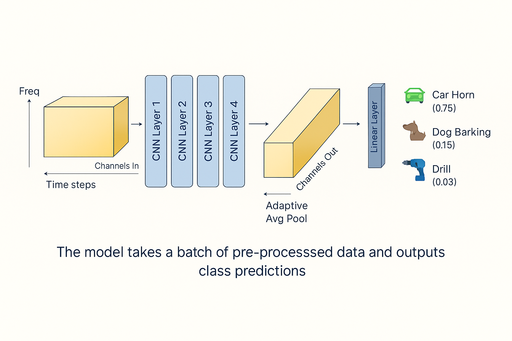

# 🎧 UrbanSound8K Audio Classification

A lightweight weekend project to explore audio processing and classification using the [UrbanSound8K dataset](https://urbansounddataset.weebly.com/urbansound8k.html).

## 📦 Dataset

This project uses the **UrbanSound8K** dataset, a collection of 8,732 labeled sound excerpts (<=4s) from 10 urban sound classes:

- air_conditioner
- car_horn
- children_playing
- dog_bark
- drilling
- engine_idling
- gun_shot
- jackhammer
- siren
- street_music

👉 Download the dataset here: [UrbanSound8K Download Page](https://urbansounddataset.weebly.com/urbansound8k.html)

> ⚠️ Note: The dataset is excluded from version control via `.gitignore`.

---

## 🧪 Goals

- ✅ Load and inspect audio metadata
- ✅ Extract Mel spectrograms from audio clips
- ✅ Apply basic data augmentation (e.g. time shift, spec augment)
- ⏳ Train a simple classifier 

This is meant to be a **practical, hands-on exploration** — not a production-ready pipeline.

---

## 🛠️ Tools & Libraries

- `torchaudio` — audio processing
- `pandas` — metadata handling
- `matplotlib` — spectrogram visualization
- `torch` — planned for model training

---

## 📈 Training Progress (Sample example)

| Epoch | Loss | Accuracy |
|-------|------|----------|
| 0     | 2.04 | 0.26     |
| 1     | 1.69 | 0.41     |
| 2     | 1.47 | 0.49     |
| 3     | 1.31 | 0.55     |
| 4     | 1.18 | 0.59     |
| 5     | 1.10 | 0.62     |
| 6     | 1.02 | 0.65     |
| 7     | 0.96 | 0.67     |
| 8     | 0.93 | 0.69     |
| 9     | 0.90 | 0.70     |

---

## 🧠 Model Architecture

The following diagram shows the CNN-based model used for classifying audio samples:

---

